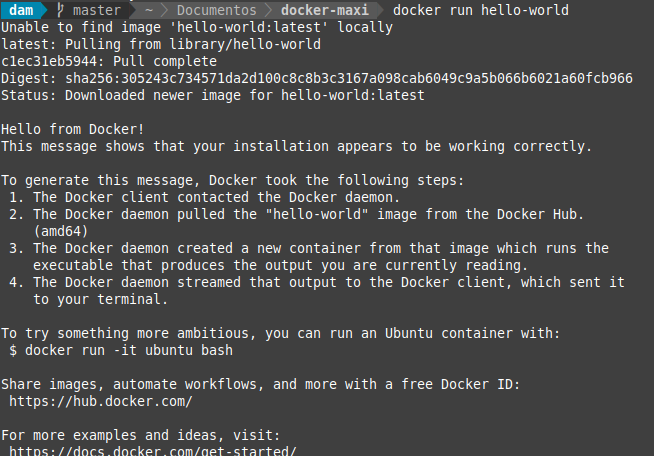

# Instalación de Apache Tomcat a través de Docker

## Índice

- [Trabajar con imágenes docker](#index01)
- [Administrar contenedores docker](#index02)

### Trabajar con imágenes docker 

### Administrar contenedores docker 

