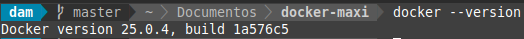
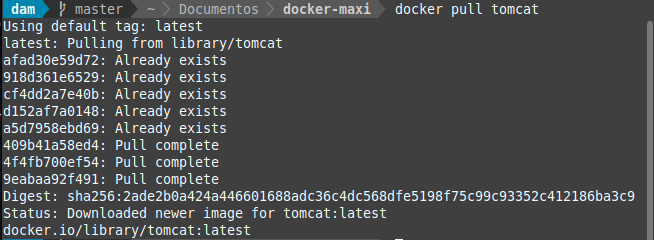
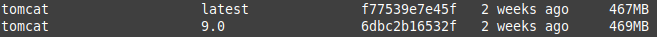
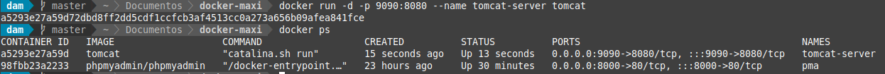
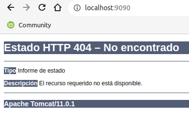
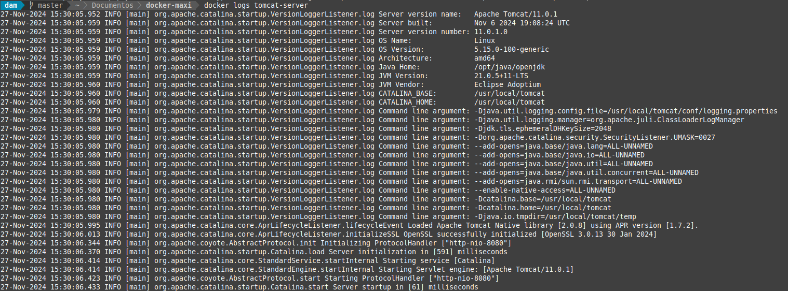
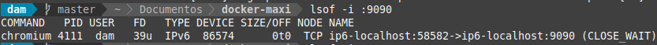
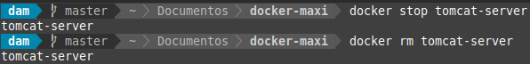
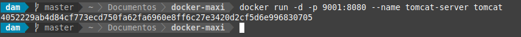

# Instalación de Apache Tomcat a través de Docker

## Índice

- [Preparación del entorno](#index01)
- [Descargar la imagen de Tomcat](#index02)
- [Ejecutar el contenedor de Tomcat](#index03)
- [Probar la Configuración](#index04)
- [Detener y eliminar el contenedor](#index05)
- [Verificación en otro puerto](#index06)

### Preparación del entorno 

### Descargar la imagen de Tomcat 

Y al ejecutar docker images:

### Ejecutar el contenedor de Tomcat 

### Probar la configuración 

Al acceder a localhost:9090, nos encontramos con:

Esto es normal, ya que no tenemos ninguna aplicación arrancada aún en apache. El contenedor en sí funciona, que es lo que nos interesa por ahora.

### Detener y eliminar el contenedor 

### Verificación en otro puerto 

Probamos que funciona todo en el puerto 9001:

