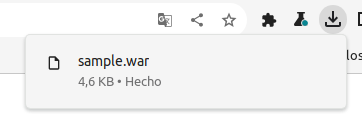
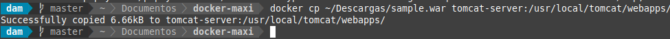
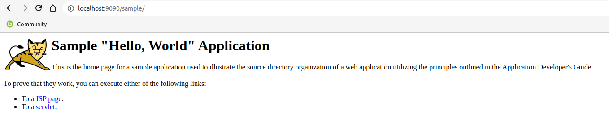
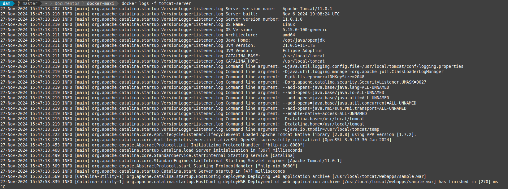

<div align="justify">

### Prueba con aplicación de ejemplo

## Índice

- [Descarga y copia en contenedor de archivo .war](#index01)
- [Acceder a la aplicación](#index02)
- [Verificación](#index03)

### Descarga y copia en contenedor de archivo .war <a name="index01"></a>





### Acceder a la aplicación <a name="index02"></a>



### Verificación <a name="index03"></a>



Y al hacer un docker inspect:

```bash
[
    {
        "Id": "a8147aca620fc48bc1aadf196fb9e857460839eac01c07fa6392beeee2e5f992",
        "Created": "2024-11-27T15:47:17.507893231Z",
        "Path": "catalina.sh",
        "Args": [
            "run"
        ],
        "State": {
            "Status": "running",
            "Running": true,
            "Paused": false,
            "Restarting": false,
            "OOMKilled": false,
            "Dead": false,
            "Pid": 31697,
            "ExitCode": 0,
            "Error": "",
            "StartedAt": "2024-11-27T15:47:17.905967581Z",
            "FinishedAt": "0001-01-01T00:00:00Z"
        },
        "Image": "sha256:f77539e7e45f7c6337c681589fe18ee6407640e4066c450fcfb8c6a4ba5575b2",
        "ResolvConfPath": "/var/lib/docker/containers/a8147aca620fc48bc1aadf196fb9e857460839eac01c07fa6392beeee2e5f992/resolv.conf",
        "HostnamePath": "/var/lib/docker/containers/a8147aca620fc48bc1aadf196fb9e857460839eac01c07fa6392beeee2e5f992/hostname",
        "HostsPath": "/var/lib/docker/containers/a8147aca620fc48bc1aadf196fb9e857460839eac01c07fa6392beeee2e5f992/hosts",
        "LogPath": "/var/lib/docker/containers/a8147aca620fc48bc1aadf196fb9e857460839eac01c07fa6392beeee2e5f992/a8147aca620fc48bc1aadf196fb9e857460839eac01c07fa6392beeee2e5f992-json.log",
        "Name": "/tomcat-server",
        "RestartCount": 0,
        "Driver": "overlay2",
        "Platform": "linux",
        "MountLabel": "",
        "ProcessLabel": "",
        "AppArmorProfile": "docker-default",
        "ExecIDs": null,
        "HostConfig": {
            "Binds": null,
            "ContainerIDFile": "",
            "LogConfig": {
                "Type": "json-file",
                "Config": {}
            },
            "NetworkMode": "default",
            "PortBindings": {
                "8080/tcp": [
                    {
                        "HostIp": "",
                        "HostPort": "9090"
                    }
                ]
            },
            "RestartPolicy": {
                "Name": "no",
                "MaximumRetryCount": 0
            },
            "AutoRemove": false,
            "VolumeDriver": "",
            "VolumesFrom": null,
            "ConsoleSize": [
                57,
                238
            ],
            "CapAdd": null,
            "CapDrop": null,
            "CgroupnsMode": "private",
            "Dns": [],
            "DnsOptions": [],
            "DnsSearch": [],
            "ExtraHosts": null,
            "GroupAdd": null,
            "IpcMode": "private",
            "Cgroup": "",
            "Links": null,
            "OomScoreAdj": 0,
            "PidMode": "",
            "Privileged": false,
            "PublishAllPorts": false,
            "ReadonlyRootfs": false,
            "SecurityOpt": null,
            "UTSMode": "",
            "UsernsMode": "",
            "ShmSize": 67108864,
            "Runtime": "runc",
            "Isolation": "",
            "CpuShares": 0,
            "Memory": 0,
            "NanoCpus": 0,
            "CgroupParent": "",
            "BlkioWeight": 0,
            "BlkioWeightDevice": [],
            "BlkioDeviceReadBps": [],
            "BlkioDeviceWriteBps": [],
            "BlkioDeviceReadIOps": [],
            "BlkioDeviceWriteIOps": [],
            "CpuPeriod": 0,
            "CpuQuota": 0,
            "CpuRealtimePeriod": 0,
            "CpuRealtimeRuntime": 0,
            "CpusetCpus": "",
            "CpusetMems": "",
            "Devices": [],
            "DeviceCgroupRules": null,
            "DeviceRequests": null,
            "MemoryReservation": 0,
            "MemorySwap": 0,
            "MemorySwappiness": null,
            "OomKillDisable": null,
            "PidsLimit": null,
            "Ulimits": [],
            "CpuCount": 0,
            "CpuPercent": 0,
            "IOMaximumIOps": 0,
            "IOMaximumBandwidth": 0,
            "MaskedPaths": [
                "/proc/asound",
                "/proc/acpi",
                "/proc/kcore",
                "/proc/keys",
                "/proc/latency_stats",
                "/proc/timer_list",
                "/proc/timer_stats",
                "/proc/sched_debug",
                "/proc/scsi",
                "/sys/firmware",
                "/sys/devices/virtual/powercap"
            ],
            "ReadonlyPaths": [
                "/proc/bus",
                "/proc/fs",
                "/proc/irq",
                "/proc/sys",
                "/proc/sysrq-trigger"
            ]
        },
        "GraphDriver": {
            "Data": {
                "LowerDir": "/var/lib/docker/overlay2/be0473a462d1e62c4ab945fe2996b99b99e5244233aa890e186b0e437486421d-init/diff:/var/lib/docker/overlay2/d015f7e558207b386b4c07a1002694bb78472eed5a72eb1fc26e8cb0158dfd86/diff:/var/lib/docker/overlay2/000612c7f243a6e191a88009b3845925b4e4b65f8ec7d13a9ebbfd8a96972dd1/diff:/var/lib/docker/overlay2/4aa4336ce8b427cca2779a7c903810203ce643d387e4d7d27e6232dd67a13ca3/diff:/var/lib/docker/overlay2/e767ce2b9596559541bdf98ce907205b0f5e24d6c1f369db6ef650e8455bc027/diff:/var/lib/docker/overlay2/b386a6cae7d05ef4d77a19c6eff6394168f7c49c0efdcc4284b0f2a97324194a/diff:/var/lib/docker/overlay2/44e0881765197a23f20f438f37123c5df3af6315556349a330d9ff680075a4e5/diff:/var/lib/docker/overlay2/599e7436bc043d44b3b062cc3d3ca635610620cb1bde61ee9168df73e8cb091b/diff:/var/lib/docker/overlay2/9cc009c28f4a1d614aa7ad807e038a929928aa8449f6bb9f41c9402029eaaedd/diff:/var/lib/docker/overlay2/ccc6b49c8a202a3f43b210919d2e80e331a1df342092cce8d80e9987d674a247/diff",
                "MergedDir": "/var/lib/docker/overlay2/be0473a462d1e62c4ab945fe2996b99b99e5244233aa890e186b0e437486421d/merged",
                "UpperDir": "/var/lib/docker/overlay2/be0473a462d1e62c4ab945fe2996b99b99e5244233aa890e186b0e437486421d/diff",
                "WorkDir": "/var/lib/docker/overlay2/be0473a462d1e62c4ab945fe2996b99b99e5244233aa890e186b0e437486421d/work"
            },
            "Name": "overlay2"
        },
        "Mounts": [],
        "Config": {
            "Hostname": "a8147aca620f",
            "Domainname": "",
            "User": "",
            "AttachStdin": false,
            "AttachStdout": false,
            "AttachStderr": false,
            "ExposedPorts": {
                "8080/tcp": {}
            },
            "Tty": false,
            "OpenStdin": false,
            "StdinOnce": false,
            "Env": [
                "PATH=/usr/local/tomcat/bin:/opt/java/openjdk/bin:/usr/local/sbin:/usr/local/bin:/usr/sbin:/usr/bin:/sbin:/bin",
                "JAVA_HOME=/opt/java/openjdk",
                "LANG=en_US.UTF-8",
                "LANGUAGE=en_US:en",
                "LC_ALL=en_US.UTF-8",
                "JAVA_VERSION=jdk-21.0.5+11",
                "CATALINA_HOME=/usr/local/tomcat",
                "TOMCAT_NATIVE_LIBDIR=/usr/local/tomcat/native-jni-lib",
                "LD_LIBRARY_PATH=/usr/local/tomcat/native-jni-lib",
                "GPG_KEYS=48F8E69F6390C9F25CFEDCD268248959359E722B A9C5DF4D22E99998D9875A5110C01C5A2F6059E7",
                "TOMCAT_MAJOR=11",
                "TOMCAT_VERSION=11.0.1",
                "TOMCAT_SHA512=dce8800532c9dcb079d456e9ea561ac9b7c854a8c50dfcd78339d077f9db127d86dba339db3fcea16c75039c9201c3446ecd4807efe0d42fcf005d2061cbc090"
            ],
            "Cmd": [
                "catalina.sh",
                "run"
            ],
            "Image": "tomcat",
            "Volumes": null,
            "WorkingDir": "/usr/local/tomcat",
            "Entrypoint": null,
            "OnBuild": null,
            "Labels": {
                "org.opencontainers.image.ref.name": "ubuntu",
                "org.opencontainers.image.version": "24.04"
            }
        },
        "NetworkSettings": {
            "Bridge": "",
            "SandboxID": "c08afc3a9560ab5be822513582884c608e505681e7eba0c5722f0fd91f0321b4",
            "SandboxKey": "/var/run/docker/netns/c08afc3a9560",
            "Ports": {
                "8080/tcp": [
                    {
                        "HostIp": "0.0.0.0",
                        "HostPort": "9090"
                    },
                    {
                        "HostIp": "::",
                        "HostPort": "9090"
                    }
                ]
            },
            "HairpinMode": false,
            "LinkLocalIPv6Address": "",
            "LinkLocalIPv6PrefixLen": 0,
            "SecondaryIPAddresses": null,
            "SecondaryIPv6Addresses": null,
            "EndpointID": "0281dd6d75202f1eb6f8b6e93aaa4bc0e3a9d268b1c13d54cf2e453fdaf0bbf4",
            "Gateway": "172.17.0.1",
            "GlobalIPv6Address": "",
            "GlobalIPv6PrefixLen": 0,
            "IPAddress": "172.17.0.2",
            "IPPrefixLen": 16,
            "IPv6Gateway": "",
            "MacAddress": "02:42:ac:11:00:02",
            "Networks": {
                "bridge": {
                    "IPAMConfig": null,
                    "Links": null,
                    "Aliases": null,
                    "MacAddress": "02:42:ac:11:00:02",
                    "NetworkID": "797f764241108f1d32a8b4649a7e3db663902a67c812e17d6fed49c9408c74c1",
                    "EndpointID": "0281dd6d75202f1eb6f8b6e93aaa4bc0e3a9d268b1c13d54cf2e453fdaf0bbf4",
                    "Gateway": "172.17.0.1",
                    "IPAddress": "172.17.0.2",
                    "IPPrefixLen": 16,
                    "IPv6Gateway": "",
                    "GlobalIPv6Address": "",
                    "GlobalIPv6PrefixLen": 0,
                    "DriverOpts": null,
                    "DNSNames": null
                }
            }
        }
    }
]

```

</div>