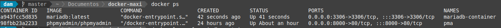

<div align="justify">

# Instalación de MariaDB

## Índice

- [Descargar e iniciar contenedor](#index01)
- [Verificación](#index02)
- [Descargar cliente de BBDD (CloudBeaver)](#index03)
- [Acceso a interfaz](#index04)
- [Conectar a MariaDB](#index05)

### Descargar e iniciar contenedor <a name="index01"></a>


### Verificación <a name="index02"></a>



Al ejecutar docker logs:

```bash
2024-11-27 16:04:57+00:00 [Note] [Entrypoint]: Entrypoint script for MariaDB Server 1:11.6.2+maria~ubu2404 started.
2024-11-27 16:04:57+00:00 [Warn] [Entrypoint]: /sys/fs/cgroup///memory.pressure not writable, functionality unavailable to MariaDB
2024-11-27 16:04:57+00:00 [Note] [Entrypoint]: Switching to dedicated user 'mysql'
2024-11-27 16:04:57+00:00 [Note] [Entrypoint]: Entrypoint script for MariaDB Server 1:11.6.2+maria~ubu2404 started.
2024-11-27 16:04:58+00:00 [Note] [Entrypoint]: Initializing database files
2024-11-27 16:05:04+00:00 [Note] [Entrypoint]: Database files initialized
2024-11-27 16:05:04+00:00 [Note] [Entrypoint]: Starting temporary server
2024-11-27 16:05:04+00:00 [Note] [Entrypoint]: Waiting for server startup
2024-11-27 16:05:04 0 [Note] Starting MariaDB 11.6.2-MariaDB-ubu2404 source revision d8dad8c3b54cd09fefce7bc3b9749f427eed9709 server_uid KjyTHYnzkWxRQBEIh5uvt04ggeY= as process 93
2024-11-27 16:05:04 0 [Note] InnoDB: Compressed tables use zlib 1.3
2024-11-27 16:05:04 0 [Note] InnoDB: Number of transaction pools: 1
2024-11-27 16:05:04 0 [Note] InnoDB: Using crc32 + pclmulqdq instructions
2024-11-27 16:05:04 0 [Note] mariadbd: O_TMPFILE is not supported on /tmp (disabling future attempts)
2024-11-27 16:05:04 0 [Note] InnoDB: Initializing buffer pool, total size = 128.000MiB, chunk size = 2.000MiB
2024-11-27 16:05:04 0 [Note] InnoDB: Completed initialization of buffer pool
2024-11-27 16:05:04 0 [Note] InnoDB: File system buffers for log disabled (block size=512 bytes)
2024-11-27 16:05:04 0 [Note] InnoDB: End of log at LSN=47629
2024-11-27 16:05:05 0 [Note] InnoDB: Opened 3 undo tablespaces
2024-11-27 16:05:05 0 [Note] InnoDB: 128 rollback segments in 3 undo tablespaces are active.
2024-11-27 16:05:05 0 [Note] InnoDB: Setting file './ibtmp1' size to 12.000MiB. Physically writing the file full; Please wait ...
2024-11-27 16:05:05 0 [Note] InnoDB: File './ibtmp1' size is now 12.000MiB.
2024-11-27 16:05:05 0 [Note] InnoDB: log sequence number 47629; transaction id 14
2024-11-27 16:05:05 0 [Note] Plugin 'FEEDBACK' is disabled.
2024-11-27 16:05:05 0 [Note] Plugin 'wsrep-provider' is disabled.
2024-11-27 16:05:06 0 [Note] mariadbd: Event Scheduler: Loaded 0 events
2024-11-27 16:05:06 0 [Note] mariadbd: ready for connections.
Version: '11.6.2-MariaDB-ubu2404'  socket: '/run/mysqld/mysqld.sock'  port: 0  mariadb.org binary distribution
2024-11-27 16:05:06+00:00 [Note] [Entrypoint]: Temporary server started.
2024-11-27 16:05:07+00:00 [Note] [Entrypoint]: Creating database exampledb
2024-11-27 16:05:07+00:00 [Note] [Entrypoint]: Securing system users (equivalent to running mysql_secure_installation)

2024-11-27 16:05:08+00:00 [Note] [Entrypoint]: Stopping temporary server
2024-11-27 16:05:08 0 [Note] mariadbd (initiated by: unknown): Normal shutdown
2024-11-27 16:05:08 0 [Note] InnoDB: FTS optimize thread exiting.
2024-11-27 16:05:08 0 [Note] InnoDB: Starting shutdown...
2024-11-27 16:05:08 0 [Note] InnoDB: Dumping buffer pool(s) to /var/lib/mysql/ib_buffer_pool
2024-11-27 16:05:08 0 [Note] InnoDB: Buffer pool(s) dump completed at 241127 16:05:08
2024-11-27 16:05:08 0 [Note] InnoDB: Removed temporary tablespace data file: "./ibtmp1"
2024-11-27 16:05:08 0 [Note] InnoDB: Shutdown completed; log sequence number 47629; transaction id 15
2024-11-27 16:05:08 0 [Note] mariadbd: Shutdown complete

2024-11-27 16:05:08+00:00 [Note] [Entrypoint]: Temporary server stopped

2024-11-27 16:05:08+00:00 [Note] [Entrypoint]: MariaDB init process done. Ready for start up.

2024-11-27 16:05:08 0 [Note] Starting MariaDB 11.6.2-MariaDB-ubu2404 source revision d8dad8c3b54cd09fefce7bc3b9749f427eed9709 server_uid KjyTHYnzkWxRQBEIh5uvt04ggeY= as process 1
2024-11-27 16:05:08 0 [Note] InnoDB: Compressed tables use zlib 1.3
2024-11-27 16:05:08 0 [Note] InnoDB: Number of transaction pools: 1
2024-11-27 16:05:08 0 [Note] InnoDB: Using crc32 + pclmulqdq instructions
2024-11-27 16:05:08 0 [Note] mariadbd: O_TMPFILE is not supported on /tmp (disabling future attempts)
2024-11-27 16:05:08 0 [Note] InnoDB: Initializing buffer pool, total size = 128.000MiB, chunk size = 2.000MiB
2024-11-27 16:05:08 0 [Note] InnoDB: Completed initialization of buffer pool
2024-11-27 16:05:08 0 [Note] InnoDB: File system buffers for log disabled (block size=512 bytes)
2024-11-27 16:05:08 0 [Note] InnoDB: End of log at LSN=47629
2024-11-27 16:05:08 0 [Note] InnoDB: Opened 3 undo tablespaces
2024-11-27 16:05:08 0 [Note] InnoDB: 128 rollback segments in 3 undo tablespaces are active.
2024-11-27 16:05:08 0 [Note] InnoDB: Setting file './ibtmp1' size to 12.000MiB. Physically writing the file full; Please wait ...
2024-11-27 16:05:08 0 [Note] InnoDB: File './ibtmp1' size is now 12.000MiB.
2024-11-27 16:05:08 0 [Note] InnoDB: log sequence number 47629; transaction id 14
2024-11-27 16:05:08 0 [Note] Plugin 'FEEDBACK' is disabled.
2024-11-27 16:05:08 0 [Note] Plugin 'wsrep-provider' is disabled.
2024-11-27 16:05:08 0 [Note] InnoDB: Loading buffer pool(s) from /var/lib/mysql/ib_buffer_pool
2024-11-27 16:05:08 0 [Note] InnoDB: Buffer pool(s) load completed at 241127 16:05:08
2024-11-27 16:05:09 0 [Note] Server socket created on IP: '0.0.0.0'.
2024-11-27 16:05:09 0 [Note] Server socket created on IP: '::'.
2024-11-27 16:05:09 0 [Note] mariadbd: Event Scheduler: Loaded 0 events
2024-11-27 16:05:09 0 [Note] mariadbd: ready for connections.
Version: '11.6.2-MariaDB-ubu2404'  socket: '/run/mysqld/mysqld.sock'  port: 3306  mariadb.org binary distribution
```

### Descargar cliente de BBDD (CloudBeaver) <a name="index03"></a>


### Acceso a interfaz <a name="index04"></a>


### Conectar a MariaDB <a name="index05"></a>


</div>