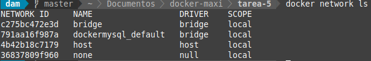
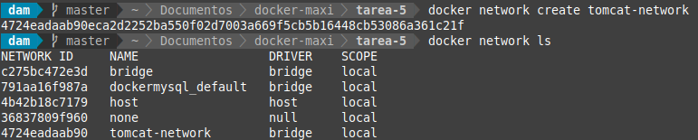
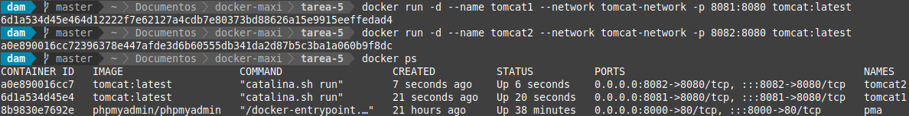
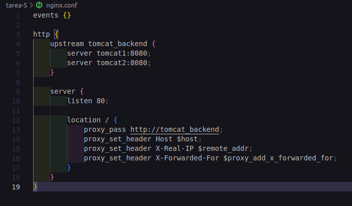
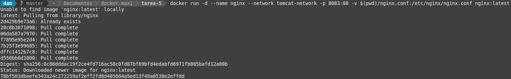
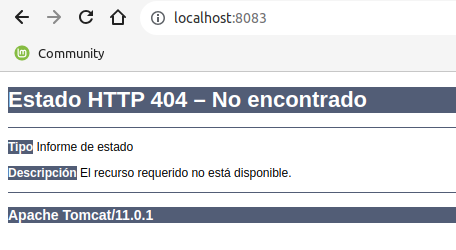

# Configuración de balancers NGINX con dos servidores Tomcat

## Índice

- [Redes disponibles](#index01)
- [Crear Red Docker](#index02)
- [Levantar servidores Tomcat](#index03)
- [Configuración NGINX](#index04)

### Redes disponibles 

### Crear Red Docker 

### Levantar servidores Tomcat 

### Configuración NGINX 

