

# Volúmenes

## Índices

- [Crear una red personalizada](#index01)
- [Crear un volumen para MongoDB](#index02)
- [Levantar contenedor MongoDB](#index03)
- [Levantar contenedor Mongo Express](#index04)
- [Verificar los contenedores activos](#index05)
- [Verificar logs](#index06)
- [Probar persistencia](#index07)
- [Comprobación al reinstalar contenedores](#index08)

### Crear una red personalizada 

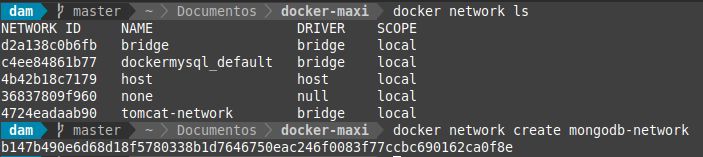
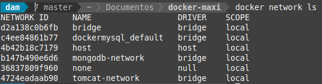

### Crear un volumen para MongoDB 

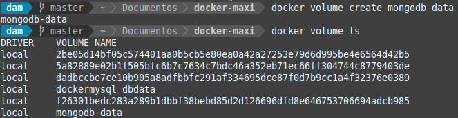

### Levantar contenedor MongoDB 

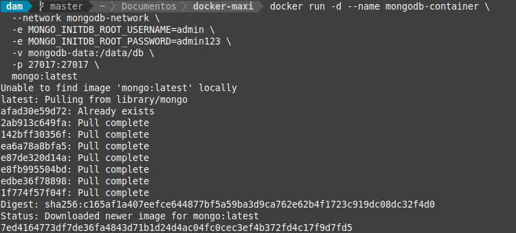

### Levantar contenedor Mongo Express 

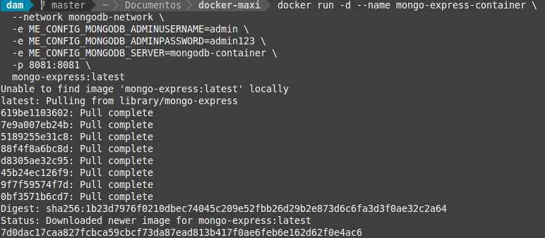

### Verificar los contenedores activos 

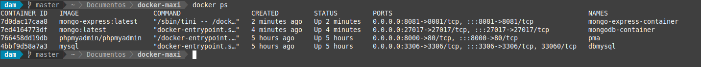

### Verificar logs 

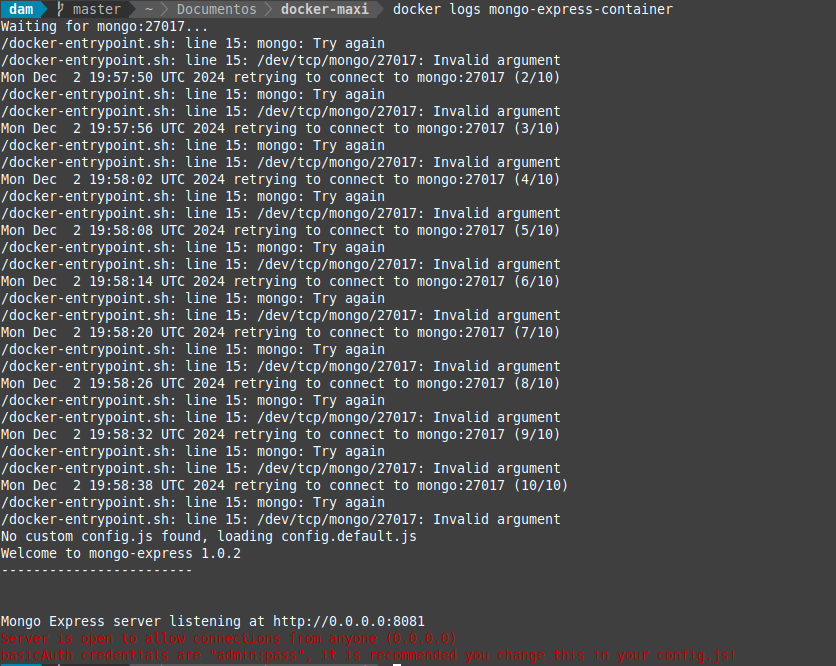
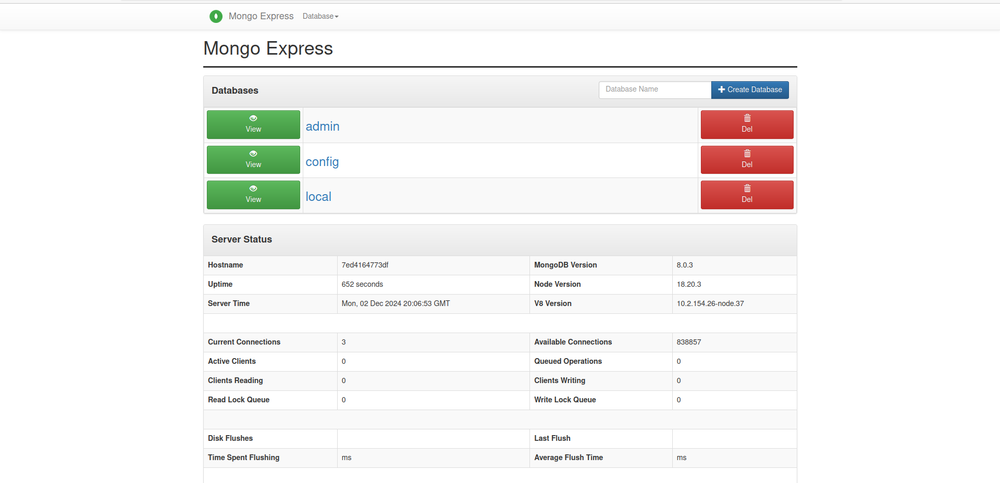
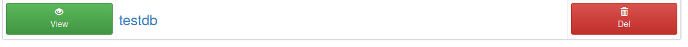
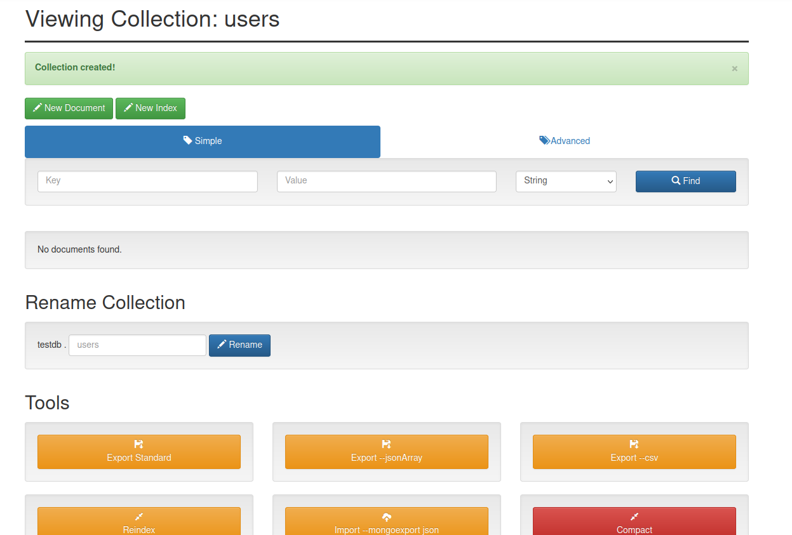
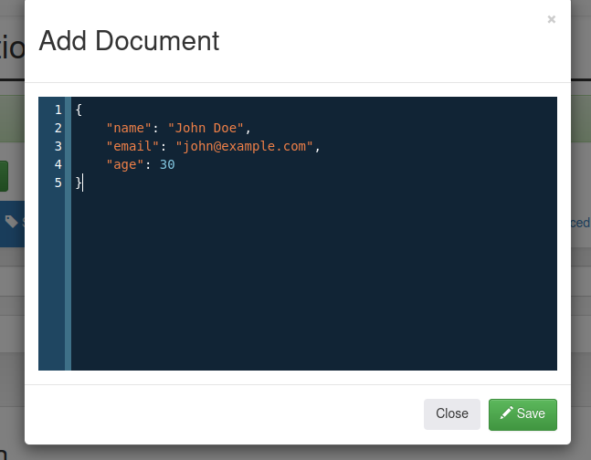
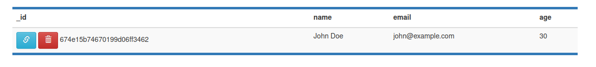

### Probar persistencia 

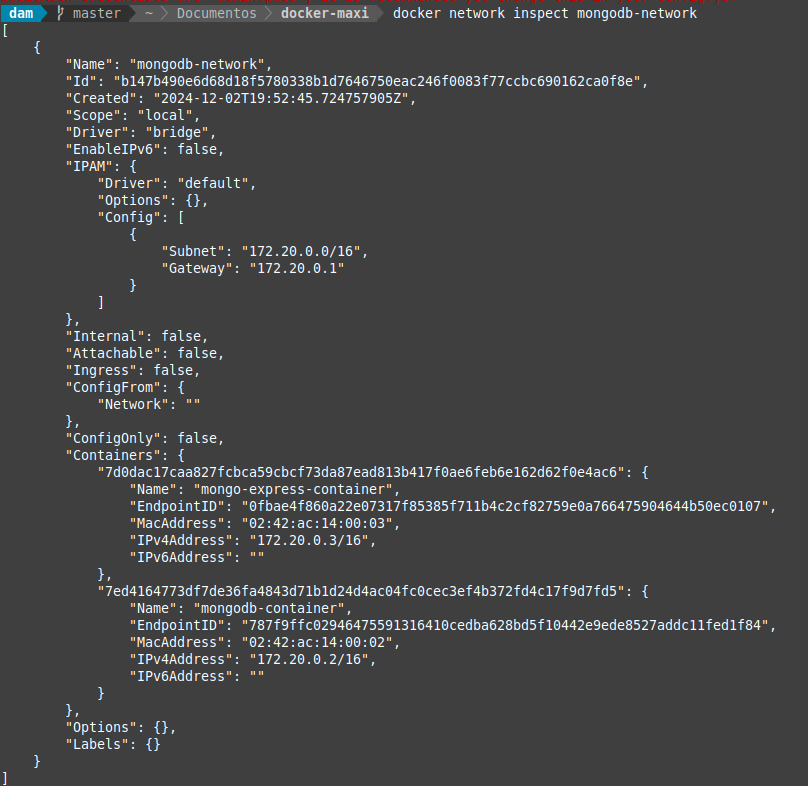
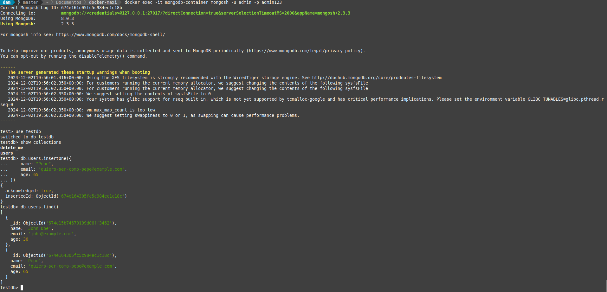

### Comprobación al reinstalar contenedores 

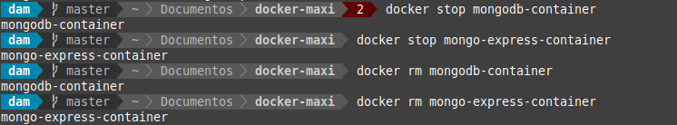
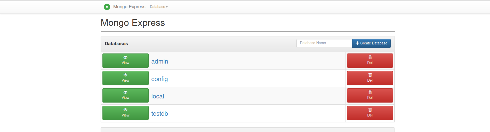

